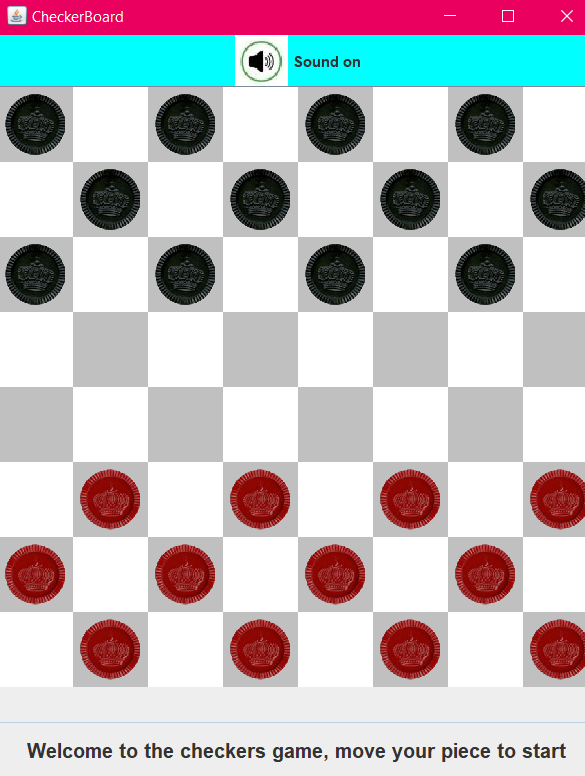

# Java Checkers

A local two-player checkers game built with Java Swing. The project demonstrates object-oriented design, event-driven input, game-state management, move validation, captures, king promotion, status feedback, and win detection.



## What the Project Does

Players take turns selecting and moving pieces with the mouse on an 8×8 board. The application validates diagonal movement, prevents control of an opponent's pieces, handles captures, promotes pieces that reach the opposite side of the board, tracks remaining pieces, and reports the winner.

## Features

- Local two-player gameplay
- Mouse-based piece selection and movement
- Turn management for black and red players
- Move validation and user-facing error messages
- Piece capture and remaining-piece tracking
- King promotion
- Win detection
- Java Swing interface with game-status feedback

## What I Implemented

I worked on the Java application structure and the core game systems, including:

- Board and square representation
- Piece state and king promotion
- Mouse-event handling
- Turn and movement rules
- Capture logic and win conditions
- Swing-based rendering and status messages

## Technology

- Java
- Swing and AWT
- Object-Oriented Programming
- Event-driven programming

## Project Structure

```text
.
├── Screenshot.png          # Gameplay screenshot
├── images/                 # Piece images
└── src/checkers/
    ├── Board.java          # Board state, move validation, captures and turns
    ├── GamePanel.java      # Main game container
    ├── InvalidMoveException.java
    ├── Main.java           # Application entry point
    ├── Piece.java          # Piece state and rendering
    └── Square.java         # Board-square state and rendering
```

## Requirements

- JDK 16 or newer
- A desktop environment capable of displaying Java Swing applications

The application uses relative paths for its image assets, so run the commands from the repository root.

## Run from the Command Line

### Windows PowerShell

```powershell
New-Item -ItemType Directory -Force out
javac -d out src/checkers/*.java
java -cp out checkers.Main
```

### macOS or Linux

```bash
mkdir -p out
javac -d out src/checkers/*.java
java -cp out checkers.Main
```

## Run in an IDE

1. Clone the repository.
2. Open or import it as a Java project.
3. Configure a JDK.
4. Use `src` as the source directory.
5. Run `src/checkers/Main.java`.
6. Keep the working directory set to the repository root so the application can locate `images/`.

## Current Scope

This version is a local two-player desktop game. Automated tests, computer-controlled opponents, forced-capture rules, and packaged releases are possible future improvements.
